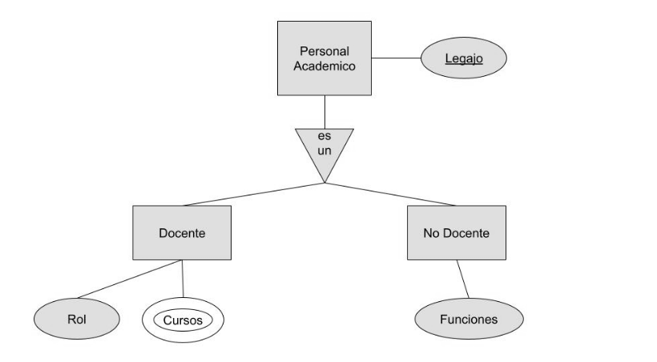

# ejercicio 8

Dado el siguiente Diagrama del Modelo Entidad Relación, realizar el pasaje a Modelo
Relacional indicando relaciones, atributos, claves primarias, y claves foráneas

 
 

PersonalesAcademicos( legajo )

Docentes(legajo , rol)

Cursos(id_curso , nombre, materia, legajoProfesor)

NoDocentes(legajo , funciones)