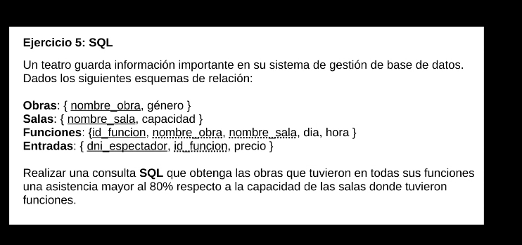

# ejercicio 3




## planeto inicial

1. calculo la asistencia de cada funcion

```SQL
--primer aprouch
SELECT f.id_funcion, COUNT(dni_espectador) 
FROM funciones AS f
JOIN entradas AS e
ON f.id_funcion  = e.id_funcion
GROUP BY f.id_funcion;

```

```SQL
-- mas apropiado
SELECT id_funcion, COUNT(*)
FROM entradas
GROUP BY id_funcion;

```


```SQL

-- aprouch final
WITH asistencias(id_funciona, cant_entradas) AS(
    SELECT id_funcion, COUNT(*)
FROM entradas
GROUP BY id_funcion;
)

SELECT * asistencias;

```

2. filtro las que cumplen con 80%(calculo los porcentajes de cada funcion)

```SQL

WITH asistencias(id_funciona, cant_entradas) AS(
    SELECT id_funcion, COUNT(*)
FROM entradas
GROUP BY id_funcion;
)

SELECT (a.cant_entradas/s.capacidad) * 100

FROM f.id_funcion, asistencias a
JOIN funciones AS f 
ON a.id_funcion = f.id_funcion
JOIN salas AS s 
ON s.nombre_sala = f.nombre_sala;

```

3.chequeo obras que cumplan con dicha condicion


```SQL
WITH asistencias(id_funciona, cant_entradas) AS(
    SELECT id_funcion, COUNT(*)
FROM entradas
GROUP BY id_funcion;
)

SELECT f.nombre_obra
FROM asistencias a
JOIN funciones f 
ON f.id_funcion = a.id_funcion
JOIN salas s ON s.nombre_sala = f.nombre_sala
GROUP BY f.nombre_obra
HAVING MIN(a.cant_entradas * 100 / s.capacidad > 80);

```