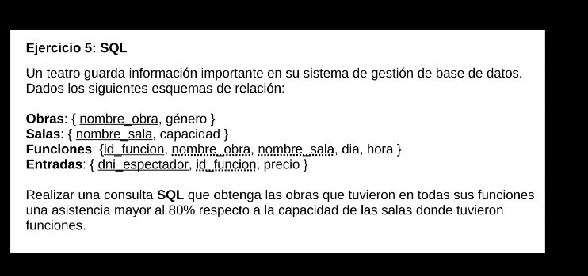

# ejercicio 3




## planeto inicial

1. calculo la asistencia de cada funcion


```SQL
CREATE SCHEMA teatro;
SET search_path TO teatro;

CREATE TABLE obras(
    nombre_obra VARCHAR(100) PRIMARY KEY,
    genero VARCHAR(50)
);

CREATE TABLE salas(
    nombre_sala VARCHAR(50) PRIMARY KEY,
    capacidad INT
);

CREATE TABLE funciones(
    id_funcion INT PRIMARY KEY,
    nombre_obra VARCHAR(100),
    nombre_sala VARCHAR(50),
    dia DATE,
    hora TIME,
    FOREIGN KEY (nombre_obra) REFERENCES obras(nombre_obra),
    FOREIGN KEY (nombre_sala) REFERENCES salas(nombre_sala)
);

CREATE TABLE entradas(
    id_funcion INT,
    dni_espectador VARCHAR(20),
    precio DECIMAL(10,2),
    PRIMARY KEY (id_funcion, dni_espectador),
    FOREIGN KEY (id_funcion) REFERENCES funciones(id_funcion)
);


INSERT INTO obras (nombre_obra, genero) VALUES
('Hamlet', 'Drama'),
('La Casa de Bernarda Alba', 'Drama'),
('El Burlador de Sevilla', 'Comedia');

INSERT INTO salas (nombre_sala, capacidad) VALUES
('Sala 1', 100),
('Sala 2', 80);

INSERT INTO funciones (id_funcion, nombre_obra, nombre_sala, dia, hora) VALUES
(1, 'Hamlet', 'Sala 1', '2023-10-01', '20:00'),
(2, 'La Casa de Bernarda Alba', 'Sala 2', '2023-10-02', '19:00'),
(3, 'El Burlador de Sevilla', 'Sala 1', '2023-10-03', '21:00');

INSERT INTO entradas (id_funcion, dni_espectador, precio) VALUES
(1, '12345678A', 50.00),
(1, '87654321B', 50.00),
(2, '11223344C', 40.00),
(2, '44332211D', 40.00),
(2, '55667788E', 40.00),
(3, '99887766F', 45.00);
```


```SQL
--primer aprouch
SELECT f.id_funcion, COUNT(dni_espectador) 
FROM funciones AS f
JOIN entradas AS e
ON f.id_funcion  = e.id_funcion
GROUP BY f.id_funcion;

```

```SQL
-- mas apropiado
SELECT id_funcion, COUNT(*)
FROM entradas
GROUP BY id_funcion;

```


```SQL

-- aprouch final
WITH asistencias(id_funciona, cant_entradas) AS(
    SELECT id_funcion, COUNT(*)
FROM entradas
GROUP BY id_funcion;
)

SELECT * asistencias;

```

2. filtro las que cumplen con 80%(calculo los porcentajes de cada funcion)

```SQL

WITH asistencias(id_funciona, cant_entradas) AS(
    SELECT id_funcion, COUNT(*)
FROM entradas
GROUP BY id_funcion;
)

SELECT (a.cant_entradas/s.capacidad) * 100

FROM f.id_funcion, asistencias a
JOIN funciones AS f 
ON a.id_funcion = f.id_funcion
JOIN salas AS s 
ON s.nombre_sala = f.nombre_sala;

```

3.chequeo obras que cumplan con dicha condicion


```SQL
WITH asistencias(id_funciona, cant_entradas) AS(
    SELECT id_funcion, COUNT(*)
FROM entradas
GROUP BY id_funcion;
)

SELECT f.nombre_obra
FROM asistencias a
JOIN funciones f 
ON f.id_funcion = a.id_funcion
JOIN salas s ON s.nombre_sala = f.nombre_sala
GROUP BY f.nombre_obra
HAVING MIN(a.cant_entradas * 100 / s.capacidad > 80);

```