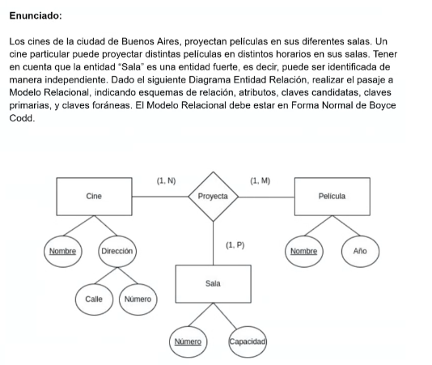
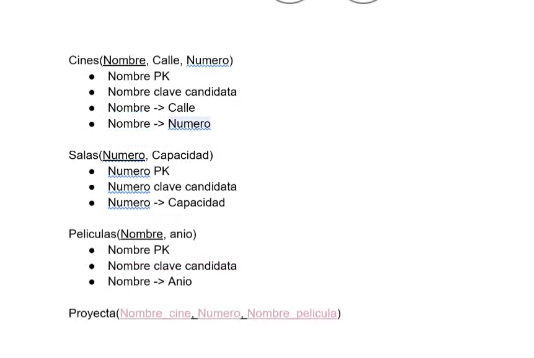
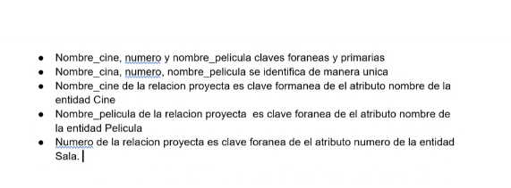

# ejercicio 2 

 
  

Cine(nombre, calle, numero)

pelicula(nombre, año)

sala(numero, capacidad)

proyecta(nombre_cine, numero, nombre_pelicula)

disclaimer: en el parcial va doble subrayado (una linea solida para indicar que las 3 son primarias y abajo de cada una una linea interlineada en cada una ya que cada una es una clave foranea y a parte pertenecen las 3 a 3 distintos atributos)

