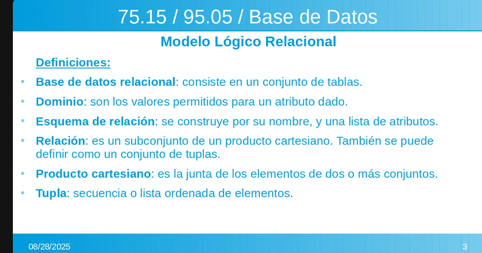
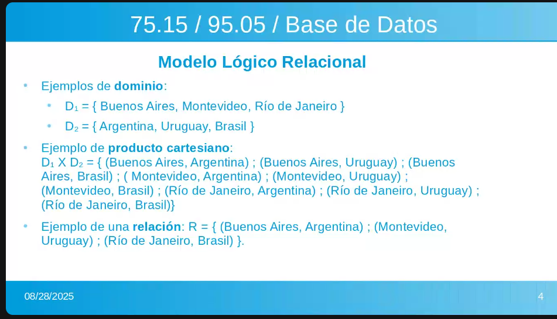
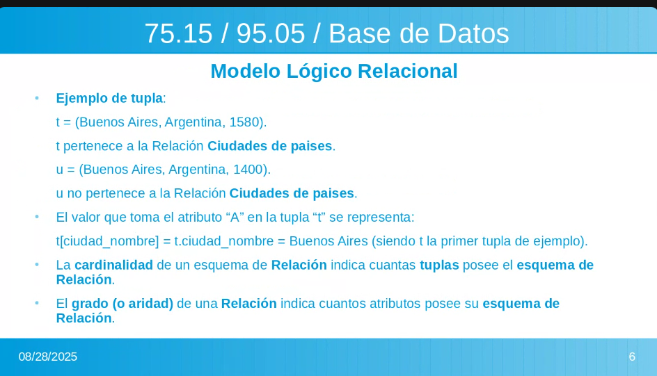
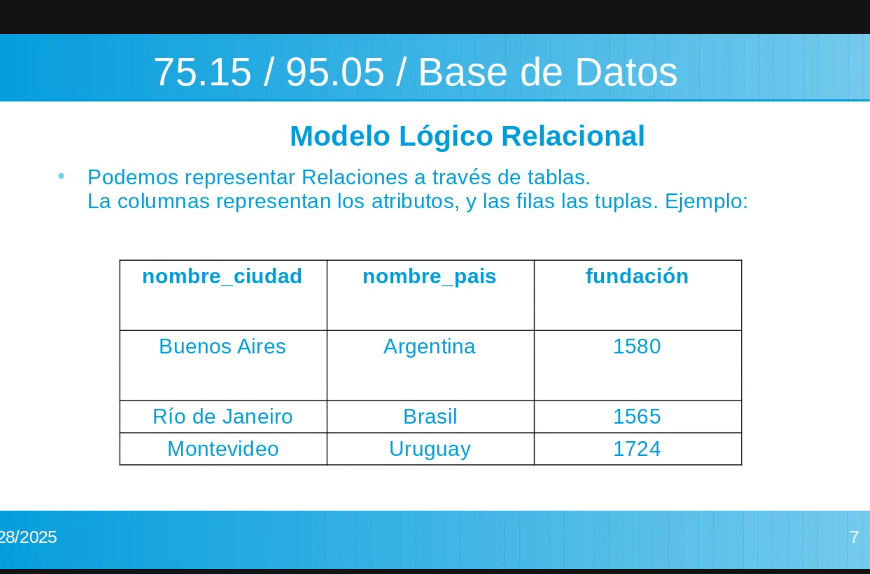
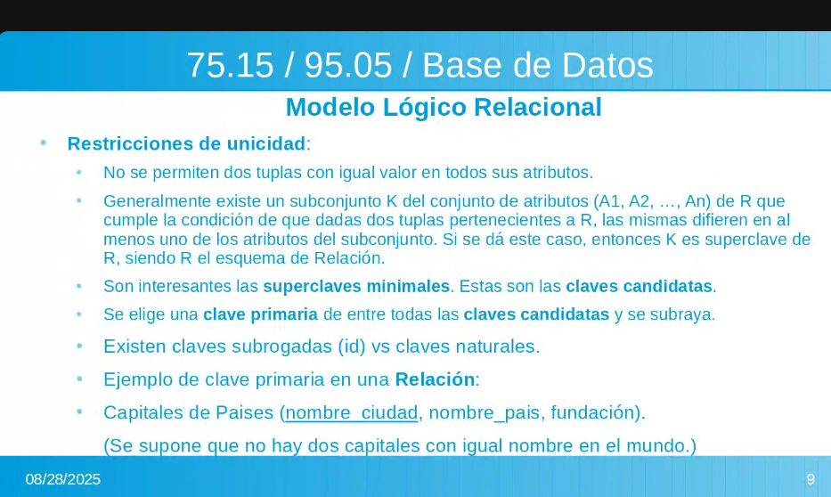
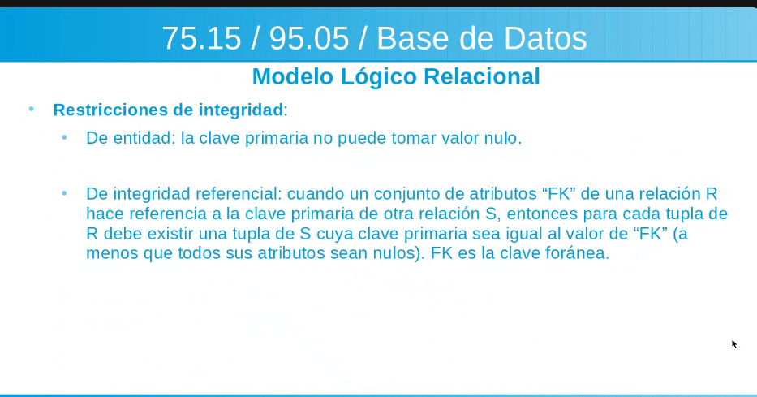
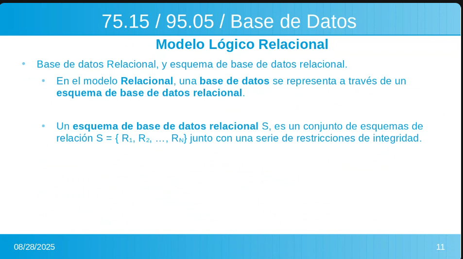
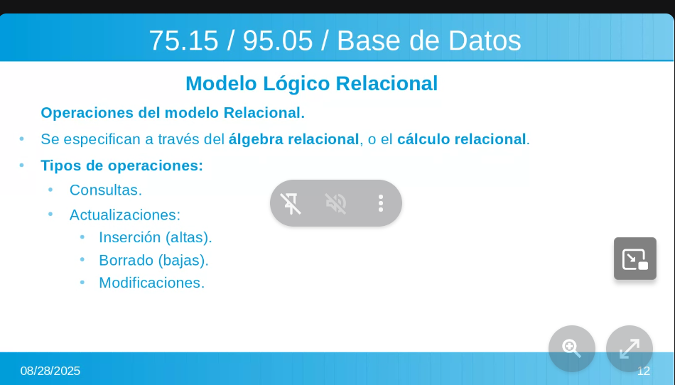
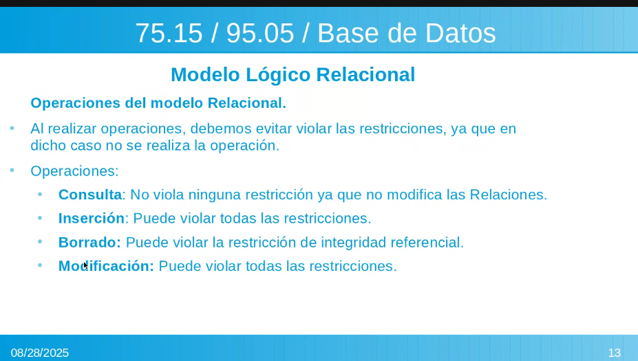

# clase 2

para hacer relaciones n a m se deben usar 3 tablas, 2 para las relaciones y una para la relacion, en la tercera tiene que se lineas punteadas en las claves de la tercera ya que son claves foraneas