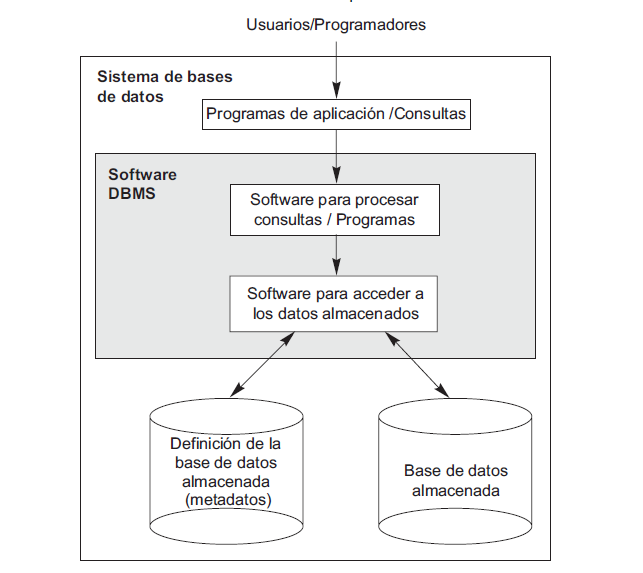
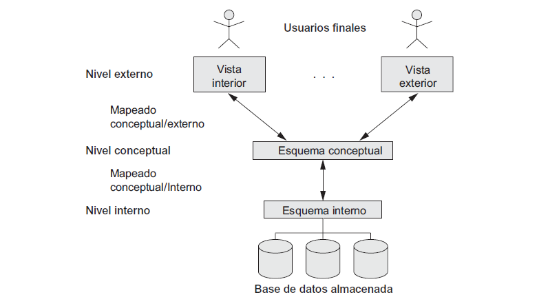
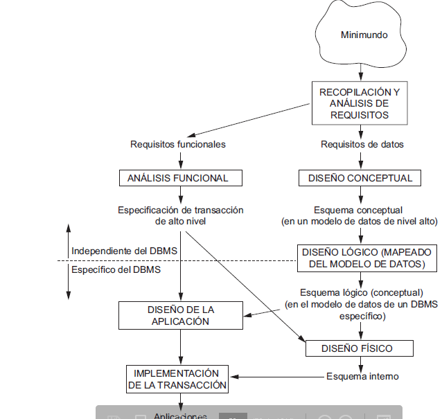
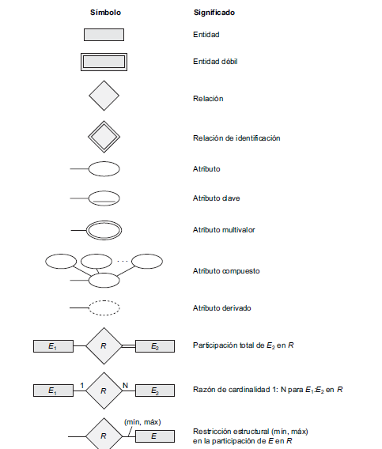

# bases de datos

una base de datos es una coleccion de datos relacionados, un dato es algo que se puede grabar y que tiene un significado implicito, ejemplo: esta lloviendo

## propiedades implicitas

- representa algun aspecto del mundo real, se lo llama minimundo o universo de discurso
- es una coleccion de datos logicamente coherente con algun tipo de significado inherente (no tendria sentido almacenar los padrones de la facu junto a las estadisticas de chacarita en el nacional b 2024)
- tiene que tener un proposito especifico

## DBMS (data base management system)

es una coleccion de programas para crear y mantener una base datos, facilita la definicion, contruccion y manipulacion de una base de datos entre varios usuarios o aplicaciones, definir una base de datos implica esoecificar el tipo de datos, estructura y restricciones de la misma 

pueden almacenar los datos en papel, disco o archivos, claramente nos centraremos en arhivos, provee un nivel de abtraccion entre pogramas o sistemas de informacion y los datos

## caracteristicas de la metodologia de bases de datos

- naturaleza autodescriptiva de un sistema de bases de datos: una base de datos provee en el catalogo (esta info se llama metadatos) la estructura de la misma, indicando el tipo de archivo, las relaciones y la manera en la que se administran los datos en la misma
- aislamiento entre programa y datos: permite que el programa no interactue directamente con los datos separando el programa de los datos
- soporte de varias vistas de los datos: una vista puede ser un pedazo especifico de la base de datos o datos derivados de los datos en la misma, una base de datos permite dicha abstraccion
- comparacion de datos y procesamiento de trasacciones multiusuario: debe permitir que multiples usuarios accedan al mismo tiempo a la base de datos establecioendo un control de concurrencia

## arquitectura de 3 capas 

- nivel interno: tiene un esquema esquema internoque describe la estructura de almacenamiento fisico de la base de datos
- nivel conseptual: describe la estructura de toda la base de datos, oculta los detalles fisicos y se concentra en describir la entidades, los tipos de datos, las relaciones y las operaciones de los usuario
- nivel vista: describe una parte especifica de la base de datos en la cual un grupo de usuarios esta interesado sin mostrar lo demas

## modelo entidad relacion(interrelacion)

el modelado conceptual es escencial para poder crear una aplicacion de bases de datos, tomando este termino como la aplicacion que se encarga de realizar consultas en dicha base de datos, en este capitulo nos centraremos en el modelo entidad relacion, dicho modelo es un modelo conceptual donde describimos en un esquema conceptual las partes mas basicas de nuestra aplicacion, como lo hace el UML en la ingenieria de software, asi como en dicho modelo se detallan estructuras y operaciones que se realizan entre las distintas clases aca se hace los mismo pero con las bases de datos

## tipos de entidades atributos y claves

una entidad representa una cosa del mundo real con una existencia independiente (existe fuera del model), puede o bien ser fisica o conceptual, un atributo es un elemento que describe dicha entidad

### atributos simples

son atributos no divisibles o sea se los puede representar en un solo atributo ejm: nacionalidad

### atributos compuestos

son aquellos que se pueden dividir en partes, ejemplo: direccion, nombre completo

### monovalor

pueden almacenar un unico valor, ejemplo edad

### multivalor

una entidad puede tener varios de este atibuto, ejemplo: emails

### almacenados

se guardan directamente en la base de datos: ejemplo fecha de nacimiento

### derivados

son consecuencia de otro atributo ejemplo: edad

### NULL

son valores no defenidos o bien porque no aplica (cargar experiencia previa de un empleado que no tuvo otro trabajo) o porque se desconoce (cargar tipo de sangre de un empleado del cual se desconoce este dato)

## dominio de un atributo

es el tipo de valor que puede tomar el mismo, un nombre puede ser un String, un dni un entero positivo mayor a 0 (long)

### tipo de entidad

define con un nombre a un conjunto de entidades que comparten atributos y relaciones ejemplo: alumnos

## atributos clave(restriccion de unicidad)

son atributos que se utilizan para distinguir a una entidad especifica

### super clave

son la mayor cantidad de atributos que pueden usarse para identeficar a una entidad especifica

### claves candidatas

es la minima cantidad de atributos que pueden usarse para identeficar a una entidad especifica

### clave primaria

es la clave que elegimos para distinguir a una entidad especifica

## relaciones 

son las conexiones que hay entre las distinta entidades, se deben poder leer en una oracion verbal "juanito tributa como monotribustista"

### grado

es de cuantas es la relacion, mayormente binaria pero puede ser unaria y ternaria

### restricciones

representa el numero minimo y maximo de una entidad que puede participar en una relacion con otra entidad, el minimo es **participacion** y el maximo **cardinalidad** se lee cruzado en la relacion

## entidades debiles

son aquellas que como tal no poseen una clavee su participacion es total respecto a la entidad fuerte, en general se crear cuando no tiene sentido que una entidad exista sin otra, ejemplo una entidad Licencia de conducir no podria existir se una entidad persona

## agregacion

se usa para establecer una relacion con otra relacion, util cuando se tiene contextos donde una relacion sola no alcanza

## proceso de armado

- determinar entidades
- determinar atributos
- determinar relaciones
- determinar claves
- restriccion de estructuras