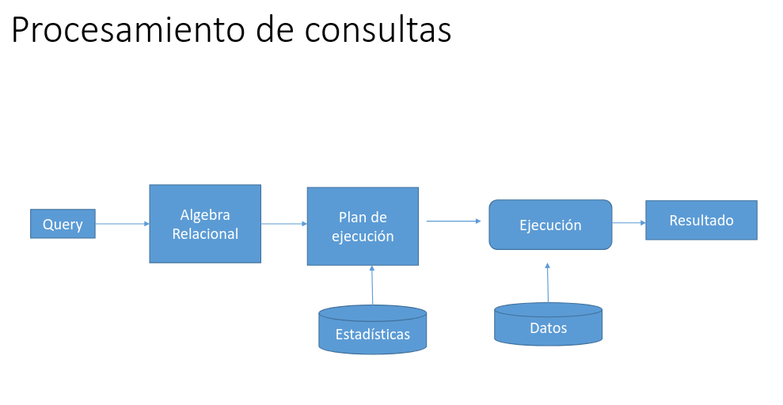

# optimizacion de consultas

mayormente enfocada en el tiempo de respuesta, 



un motor de bases de datos primero recibe una exprecions y la parsea a un estandar, esto para estar seguro de que consulte el usuario, acto seguido convierte ese parsea a una expresion de algebra relacional, acto seguido el motor de base de datos elige un plan de ejecucion, ya que en el algebra relacional existen varias maneras de realizar una misma operacion, hay distintas euristicas para elegir el camino de ejecucion mas optimo, un ejemplo de heuristica (son conocimientos desarrollados en base a la experiencia y no necesariamente matematicamente comprobadas), un ejemplo de heuristica que siempre conviene hacer una seleccion antes de una proyeccion, pero por ejemplo cuanto se tienen atributos grandes como por ejemplo una imagen guardada en base64 conviene hacer primero la proyeccion, otra heuristica es evitar el producto cartesiano (en 2 tablas de 1000 elementos tendrias 1000000 de resultados), suponiendo que tengo 2 joins hacer primero el que mas achique los datos (el que tenga resultados mas chicos), una base de datos suele manejar estadisticas para tomar esa decision

sql te puede mostrar el plan de ejecucion

estadisticas que guarda la bdd: N(R) -> cantidad de filas, B(R) -> cantidad de bloques, los datos siempre estan en un disco, pero los datos se procesa en memoria, por no decir que la mayoria de veces se encuentran en la red, asumimos que el costo esta dado por el disco, el que determina el costo del tiempo son los bloques ya que el tiempo depende de cuanto se tarda en comunicarse con el disco (hacer la lecto escritura), esto se mide en F(R) = N(R)/B(F) o sea filas por bloque, por ultimo afecta la variabilidad = V(R,A) 1 <= n, es que tanto varia un atributo, está orientada en torno a la cantidad de datos que podrian cambiar en nuestro caso especifico

## ordenar tabla

tener la tabla ya ordenada te permite acortas las busquedas, por otro lado es muy comun pedir listados ordenados

## indices

suponiendo que haya dos maneras de ordenar una tabla, se podria tener una tabla auxiliar que contenga, la segunda clave mas buscada de la tabla y su pocision fisica en la tabla principal de esa clave, esto para optimizar la busqueda por esa clave, en el ejemplo tenemos una tabla de alumnos ordenada por padro, para poder buscar de manera optima por dni se podria tener otra tabla que solo tenga los dni y su posicion en la otra tabla para que al buscar por dni se busque en esa tabla auxiliar y desde ahi a la tabla principal, estas tablas auxiliares se la llama indicie

los indices reales en realidad son arboles, arboles B, a diferencia del arbol binario estas hojas tienen rangos, estos tienen profundidad fija para que nunca este desbalanceado

para crear un indice es
```sql
CREATE INDEX nombreIndex ON nombreTabla (columnas)
```


### tipos de indices

#### cluster

en cada nodo de hoja estan todos los datos de la tabla, hay un solo cluster por tabla

##### primario (es un caso particular de cluster)

si la clave del cluster es la clave primaria se llama primario


##### secundarios

todos los clusters cuya clave para ordenar no sea la primaria

### resumen de indices

es importante entender que no se hacen indices por todo, la idea es hacerlos en casos especificos donde una clave o atributo es muy consultado, no tendria tanto sentido hacer un indice por pais de origen de alumno como por padron del mismo

## costo en busquedas

este suele estar determinado por B(R)

cuando tenemos un indice y es 
H es altura del arbol
indice primario este H + 1, 
si estan en bloques separados es H + cantidad  
indice secundarios es H + N(r)/V(r,a) 

Indices cluster es H + N(r)/(V(r,a) * F(r))

si usamos distinct te baja la complejidad a n = log2^n

## coste de join

tengo que comparar cada elemento de una tabla con cada una de la otra, por cada bloque yo lo que haria seria agarrar un primer bloque de b1 y compararlo con todos los bloques de b2  y asi sucesibamente

queda tipo b1*b2

si tengo indice esto se achica a 
 
B1 * costo de indice de B2
 
## ANALYZE

actualiza el catalogo de una tabla

## explain

EXPLAIN consulta en tabla como ejemplo SELECT * FROM TABLA , te tira cuantas rows y eol ancho en bbits de cada una tiene la tabla, tambien tiene cuanto cuesta en seg la operacion  