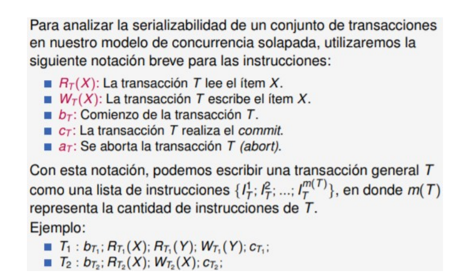
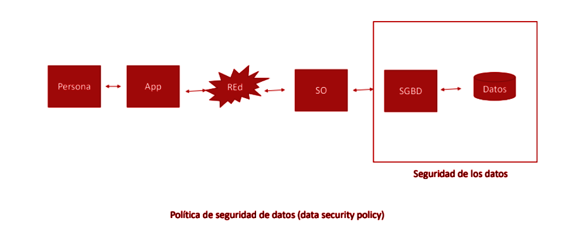
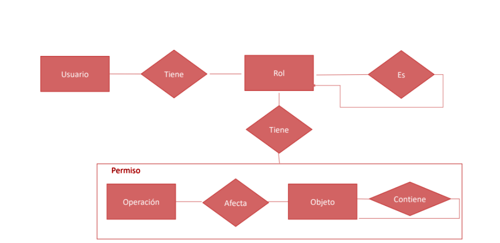
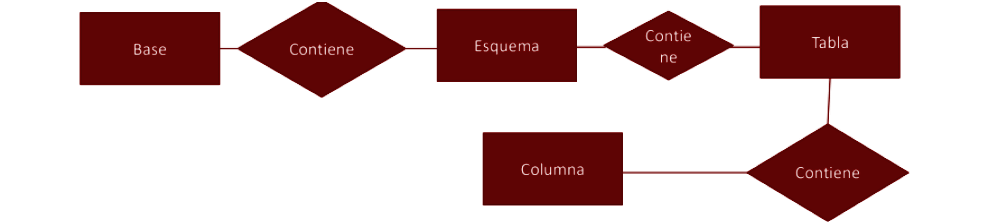

# resumen final

## optimizacion de consultas

la optimizacion de consultas es el proceso de transformar una consulta en una forma equivalente que se pueda ejecutar de manera mas eficiente, el objetivo es reducir el costo de ejecucion en terminos de tiempo y recursos

## como maneja el SDGB una consulta

### 1 query

un usuario escribe una consulta en SQL

### 2 algebra relacional plan logico

el motor traduce la query a un plan logico basado en operaciones del algebra relacional

### 3 optimizador y plan de ejecucion(plan fisico)

el optimizador toma el plan logico y genera uno o varios planes fisicos:
- elige file scan o index scan
- elige el tipo de join (nested loop, hash join, merge join)
- elige el orden de joins en que momento aplicar filtros

### 4 estadisticas

el optimizador se apoya en estadisticas del catalogo:
- cuantas filas tiene una tabla
- cuantos bloques ocupa
- distribucion de valores, cardinalidad, etc.

### 5 ejecucion

el motor de ejecucion toma el plan fisico y lo ejecuta
- accede a paginas en disco
- recorre indices
- aplica filtros
- hace joins, agrupaciones, ordenamientos

### 6 resultado
- la ejecucion es la unica etapa donde realmente se leen/escriben datos
- finalmente se devuelven las filas pedidas al usuario

## catalogo

es un conjunto de tablas internas del sistema que almacenan metadatos, nombres de tablas, columnasm tipos, indices, cp, cf y cantidad de filas

- siendo r una relacion
- siendo a un atributo de r
- n(R) cantidad de tuplas
- B(r) cantidad de bloques
- V(a,r) cantidad de valores distintos del atributo a en r
- F(R) cantidad de tuplas de R que entran en un bloque

entonces
```math
F(R) = \frac{N(R)}{B(R)}
```
## tipos de costos

- acceso a disco: (lectura/escritura de bloques)
- red(en sistemas distribuidos)
- memoria(uso de buffers, operaciones en memoria)
- cpu(procesamiento, aplicar filtros, calculos)

Regla mental: el acceso a disco es el costo mas significativo, por eso el uso de indices.

## indices

es una estructura auxiliar que permite encontrar filas rapidamente sin leer toda la tabla

```math
Alumnos(padrón, dni, apellido, nombre, ...)
Indice sobre dni -> (dni, dirección_bloque)
```

## tipos de indices

### por estructura de datos

#### indices asociativos hash

usan una funcion hash sobre la clave para determine en que bucket(direccion de bloque) va cada entrada

- son rapidos para busquedas de igualdad
- complejidad promedio O(1)

limitaciones:

- no sirven para rangos (el hash desorden)
- no optimizar order by ni group by
- pueden tener colisiones

#### indices ordenados (arboles B+)

- usan arboles B/ B + balanceados 
- los valores clave estan ordenados en hojas

- permiten busquedas por igualdad y por rango
- optimizan order by y group by
- complejidad O(log n) en busquedas, inserciones y borrados

- son el estandar en postgres, mysql, oracle

### indices por relacion con el almacenamiento

#### indices primarios
- esta definido sobnre el o los atributos que determinan el orden fisico de la tabla, suele coincidir con la clave primaria

#### indices de cluster
- ordena fisicamente la tabla por un atributo que no es clave primaria(puede tener duplicados), beneficia lecturas por rango de ese atributo

#### indices secundarios

- indice sobre un atributo que no define el orden fisico de la tabla, puede ser clave o no clave
- no reordena la tabla, solo sirve para acceso rapido

## file scan vs index scan

- file scan: recorre todas las filas de la tabla

-- costo aproximado: B(r) lecturas de bloque

- index scan: usa indices para llegar solo a las filas que interesan

-- costo aproximado: altura del arbol + cantidad de bloques de datos a leer

## heuristicas de optimizacion

- seleccion primero: aplicar σ lo antes posible reduce la cantidad de filas
- proyeccion primero: aplicar π temprano reduce cantidad de columnas
- remplazar el producto cartesiano por joins
- de hacer dos joins se empieza por el que reduzca mas filas

## costos aproximados de operaciones

## costos aproximados de operaciones

- seleccion σ sin condiciones : ≈ B(r) 
- seleccion σ con indice: 
  -- ≈ altura del arbol + cantidad de bloques de datos con resultado
  -- si el indice es cluster se aprovecha el orden fisico

- seleccion σ por igualdad (a = cte)

- indice cluster:

```math
altura(arbol) + \frac{N(r)}{V(a,r)} \cdot \frac{1}{F(r)}
```

- indice secundario:

```math
altura(arbol) + \frac{N(r)}{V(a,r)}
``` 
- indice primario:

```math
altura(arbol) + 1
```

- proyeccion π sin eliminacion de duplicados: ≈ B(r)
- proyeccion π con eliminacion de duplicados: ≈ 
```math
2 \cdot B(r) \cdot \log_2(B(r)) - B(r)
```


- join por nested loop anidado entre dos tablas r y s:

```math
costo = B(r) \cdot B(S) + B(R) o B(S) \cdot B(R) + B(S)
```

- join con indice en la tabla interna:

```math
costo = B(Outer) + N(Outer) \cdot H(inner)
```


## concurrencia y transacciones

la concurrencia radica en poder aprovechar al maximo la capacidad de procesamiento en post de una mejor atencion al usuario de la base de datos, tenemos sistemas mono procesador, multi procesador y distribuidos donde la buena gestion de la concurrencia puede mejorar el rendimiento de la base

## transacciones

es una unidad logica de trabajo compuesta por una secuencia de operaciones (atomica) de consulta o abm, queremos que se ejecuten todas o ninguna, para mantener la integridad de los datos

la **concurrencia** es la posibilidad de ejecutar multiples transacciones en forma simultanea, el problema que genera esta misma es la gestion de los recursos compartidos.

en este modelo vamos a asumir que 

- hay un solo procesador
- cada transaccion esta formada por instrucciones atomicas
- el scheduler puede suspender y reanudar transacciones en cualquier momento

### ITEM

puede representar el valor de un atributo de una fila de una talba, una fila completa, un bloque de disco, una tabla, etc.

las instrucciones atomicas son:

- leer_item(x): lee el valor de item x en memoria
- escribir_item(x): escribe el valor de item x en la bdd

## propiedades ACID

el gestor debe garantizarlas en todo momento

- atomicidad: todas las instrucciones se ejecuten o no deben ser atomicas
- consistencia: cada ejecucion debe preservar la concistencia en los datos, se define con reglas de integridad
- aislamiento: la ejecucion concurrente de las transacciones debe ser el mismo que si las transacciones se ejecutaran en forma aislada una tras otra de forma serial, lo que el usuario debe ver es que si el revisa los datos post solpamiento estos deben verse como si la consulta huebiera sido secuencial
- durabilidad: una vez que la transaccion se ha confirmado, los cambios deben persistir en la bdd

estos se garantizar con mecanismos de recuperacion, estos tienen las instrucciones especiales de 

- begin_transaction: inicia una transaccion
- commit: confirma los cambios realizados por la transaccion
- abort: deshace los cambios realizados por la transaccion

estos mecanismos se registran en un archivo lo que permite cumplir con ACID, si ocurre un fallo se puede recuperar el estado de la bdd

## anomalias

son situaciones que pueden violar ACID , se le dice anomalias cuando ya no tienen reparacion, sino son fenomenos que pueden ser controlados

#### dirty read

- sucede cuando una transaccion lee un item que fue modificado que aun no se commiteo, es un conflicto de escritura
- una vez que pasa no tiene solucion, rompe la consistencia
- la forma de evitarlo es no permitir que la transaccion haga commit hasta que la otra haga commit o abort (bloqueos)

#### lost update

- alguien escribio lo que otro ya habia leido, deriva en una anomalia si despues el primer usuario vuelve a escribir (lost update) o vuelve a leer (lectura no repetible)

- se pisa una modificacion con algo ya leido.

- rompe el aislamiento

#### dirty write

ocurre cuando una transaccion t2 escribe un item que ya habia sido escrito por otra transaccion t1 que luego se deshace, rompe la atomicidad

#### phantom

aparecen o desaparecen filas en una consulta repetida dentro de una misma transaccion, rompe el aislamiento

- transaccion t1 observa un conjunto de items con una condicion, el conjunto cambia por la accion de otra transaccion t2 y entonces t1 vuelve a ejecutar la consulta y obtiene un conjunto diferente

## notacion 



### solapamiento

entre dos transacciones es cuando T1 y T2 es una lista de m(t1) + m(t2) instrucciones en donde cada instruccion t1 y t2 aparece una unica vez y las instrucines de cada transaccion conservan un orden

solapamientos posibles:
```math
\frac{(m(t1) + m(t2))}{m(t1)! \cdot m(t2)!}
```


### ejecucion serial

las transacciones se ejecutan por completo una tras otra en base a algun orden, decimos que un solapamiento es serializable si las transacciones T1, T2, ..., TN cuando se ejecutan en ese orden dejan la base de datos en un estado equivalente a que si se hubieran ejecutado en forma serial

### equivalencia

- por resultados finales: dos solapamientos son equivalentes si al finalizar ambas dejan la base de datos en el mismo estado

- por conflictos: dos solapamientos son equivalentes si se pueden transformar uno en otro mediante la reordenacion de instrucciones no conflictivas

- por vistas: dos solapamientos son equivalentes si para cada lectura en un solapamiento lee el mismo valor que en el otro solapamiento

### conflictos

 dado un orden de ejecucion de instrucciones de transacciones, dos instrucciones son conflictivas si (I1, I2), dos instrciones de distintas transacciones son conflictivas si:

- ambas son escrituras sobre el mismo item
- una es lectura y la otra escritura sobre el mismo item
- ambas son escrituras sobre el mismo item

### grafo de precedencia 

- nos dice si hay conflictos
- es un grafo dirigido donde cada nodo es una transaccion y hay una arista de Ti a Tj si una instruccion de Ti precede y es conflictiva con una instruccion de Tj
- los nodos son transacciones y se agrega un arco entre los nodos si hay conflicto entre las instrucciones de ambas transacciones
- si el grafo tiene ciclos, el solapamiento no es serializable

## control de concurrencia

tenemos dos metodos principales

- enfoque pesimista: busca garantizar que no se produzcan conflictos, se basa en el uso de bloqueos
- enfoque optimista: permite que las transacciones se ejecuten sin restricciones y luego verifica si hubo conflictos, si los hubo se deshacen las transacciones involucradas

### bloqueos

- un bloqueo es un mecanismo que restringe el acceso concurrente a un item
- los inserta en el SGBD para controlar el acceso a los items
- no es trivial definir el nivel de granularidad del bloqueo
- LOCK y UNLOCK son las operaciones basicas de bloqueo

- los bloqueos pueden ser de dos tipos:

  - bloqueo de lectura (shared lock): permite que varias transacciones lean un item simultaneamente, pero impide que alguna transaccion escriba en el item mientras este bloqueado para lectura

    - bloqueo de escritura (exclusive lock): permite que una sola transaccion escriba en un item, impidiendo que otras transacciones lean o escriban en el item mientras este bloqueado para escritura

- No puedo adquirir un lock luego de desbloquear un lock (protocolo de lock de 2 fases)

- el protocolo nos dice que va a ser serializable


### timestamping

- a cada transaccion se le asigna un timestamp unico al inicio de la misma

- los timestamps son unicos y determinan el orden serial de las transacciones

- se permite la ocurrencia de conflictos pero que se resuelven en base a los timestamps

- no tiene deadlocks

## control de concurrencia multiversion

- se mantienen varias versiones de un mismo item
- cada transaccion tiene un snapshot de la base de datos al inicio de la misma
- las lecturas no bloquean escrituras y viceversa
- cuando dos transacciones intentan escribir el mismo item, se aplica un protocolo de first-committer-wins

## recuperacion

- la serializacion garantiza el aislamiento pero no la durabilidad
- queremos que una operacion ya commiteada no se pueda deshacer

un solapamiento es recuperable si ninguna transaccion T realiza el commit hasta tanto todas las transacciones que escribieron datos antes de que T los leyera hayan hecho commit

- hay que mirar las lecturas si alguien lee algo que otro escribio y ese otro se aborta, el que leyó debe abortar tambien

- un SDGB debe garantizar que los solapamientos sean recuperables


## seguridad en bases de datos

### seguridad de la informacion

son conjuntos de procedimientos y medidas para proteger los componenetes de los sistemas de informacion

## factores

- confidencialidad: la informacion no es ofrecida a personas no autorizadas

- integridad: asegura la correctitud durante el ciclo de vida de la informacion

- disponibilidad: asegura que la informacion este disponible a las personas autorizadas cuando la necesiten

- no repudio: quien accedio a la informacion no puede negar haberlo hecho



## control de acceso basado en roles

define roles para las distintas activiidades y funciones con el objetivo de regular el acceso a los recursos de la base de datos

- usuarios: personas
- roles: conjunto de funciones y responsabilidades
- objetos: aquellos recursos a los que se accede (tablas, vistas, procedimientos, etc)
- permisos: acciones concedidas o revocadas a un usuario o rol sobre un objeto



soporta 3 principios

- criterio del menor privilegio posible: si un usuario no va a realizar una accion no deberia tener permiso para hacerlo

- division de responsabilidades: nadie debe de tener suficientes permisos para usar el sistema por si solo, necesita la colaboracion de otros

- abstraccion de datos: los permison son abstractos y dependen del objeto, no de la implementacion



## data warehousing

un data warehouse es una base de datos orientada a consultas analiticas no a transacciones, se usa para tomar decisiones estrategicas en una organizacion, analisis de tendencias, reportes, KPI, mineria de datos, etc

es distinto a una base de datos transaccional (OLTP) en varios aspectos:

### oltp (on-line transaction processing)

- los datos se generan dinamicamente
- capacidad transaccional
- arquitectura de 3 capas
-- presentacion: interfaz de usuario
-- logica: capa intermedia, hace de servidor, recibe y ejecuta consultas
-- capa de datos: donde se almacenan los datos

### olap (on-line analytical processing)

- consultas lentas y pesadas (joins, agregaciones, etc)
- se tiene regristro de los datos y la capacidad de procesarlos, surgio de la necesidad de aprovecharlos para tomar decisiones
- hacer falta reducir la cantidad de datos y poder expresar consultas complejas

#### arquitectura tipica(3 capas)

- presentacion: herramientas de visualizacion, dashboards, reportes
- logica de negocio: reglas de transformacion, consultas OLAP.
- datos: data warehouse, data marts, staging area

## ETL (extract, transform, load)

- extract: se extraen datos de diversas fuentes (OLTP, archivos, APIs)

- trasform: se eliminan duplicados, inconsitencias y errores, homogenizan(unificar formatos),calculan derivados y validan los datos

- load: se insertan los datos limpios en el DW(generalmente en tablas dimension y hechos)

## modelado multidimensional

es la forma de organizar los datos en un DW para facilitar el analisis.

- tabla de hechos: contiene las medidas cuantitativas (ventas, ingresos, etc) y claves foraneas a las tablas dimension

- tablas dimension: contienen atributos descriptivos (tiempo, producto, cliente, etc) que permiten analizar las medidas desde distintas perspectivas

### modelo estrella

- tabla de hechos central conectada a varias tablas dimension

la tabla de hecos contiene valores agregables(sum, count) y las dimenciones descriven los ejes de analisis


las dimensiones pueden tener jerarquias (año > trimestre > mes > dia) que permiten hacer drill-down y roll-up en los analisis


## operaciones OLAP

- roll-up: sube jerarquia
- drill-down: baja jerarquia
- pivoteo: cambia perspectiva
- slice: fijar una dimension en un valor
- dicing: fija n dimensiones a la vez

## mantenimiento de cubos

- los cubos OLAP son estructuras precomputadas que almacenan datos agregados para acelerar las consultas analiticas

- lazy: se actualizan solo cuando se accede a ellos
- periodico: se actualizan en intervalos regulares
- forzado por cantidad de cambios: se actualizan cuando hay un umbral de cambios en los datos fuente

## bases de datos no sql

### sharding (horizontal partitioning)

distribuye las relaciones en subrelaciones más pequeñas llamadas shards. cada shard se almacena en un servidor diferente, lo que permite distribuir la carga de trabajo y mejorar el rendimiento.

### replicación (vertical partitioning)


## disponibilidad

es lo mas importante en las bases de datos nosql. se refiere a la capacidad del sistema para estar operativo y accesible en todo momento, incluso en caso de fallos o interrupciones.

## confiabilidad

es la probabilidad de que un sistema funcione correctamente durante un periodo de tiempo determinado. en las bases de datos nosql, la confiabilidad se logra mediante la replicación de datos y la tolerancia a fallos.

## fallo 

es la desviacion del comportamiento esperado.

## error

es el conjunto de estados en que queda un sistema luego de un fallo.

## escalabilidad

antes se hacian mejoras al servidor pricipal (escalado vertical) pero tiene un limite fisico. ahora se agregan mas servidores al sistema (escalado horizontal).

## tolerancia a particiones

si hay fallos red puede pasar que un grupo de nodos queden aislados del resto. la tolerancia a particiones es la capacidad del sistema para seguir funcionando correctamente a pesar de estas particiones.

## autonomia

indica que tan independienes son los nodos del resto del sistema. 

- autonomia de diseño
- de comunicacion
- de ejecucion

## ventajas de las bases de datos nosql

- las lecturas son mas rapidas 
- mayor escalabilidad
- mayor desempeño
- flexibilidad en aplicaciones distribuidas

## particiones (shardings / fragmentacion)

- fragmentacion horizontal (sharding): cada fragmento contiene un subconjunto de tuplas de la tabla original.

- fragmentacion vertical: es un subconjunto de atributos de la tabla original. cada fragmento contiene un subconjunto de columnas de la tabla original.

- fragmentacion hibrida: combina la fragmentacion horizontal y vertical.

- un esquema de asignacion de fragmentos a sitios es una funcion que asigna cada fragmento a un sitio de la red.

## replicacion

- mejora la disponibilidad de los datos.
- un caso extremo es la replicacion completa, donde cada sitio tiene una copia completa de la base de datos (no es comun en bases de datos grandes).
- tiene como desventaja el costo de actualizar/insertar datos en multiples sitios.
- se complejiza el control de concurrencia.
- si no hay replicacion los fragmentos son disjuntos.
- tambien puede haber replicacion parcial, donde algunos fragmentos son replicados en varios sitios y otros no.

## mongo db (base de datos no relacionales)

no sql es no solo sql (no solo lenguaje estructurado de consultas), mas valido decir no es, son bases de datos no relacionales, la diferencia principal es la flexibilidad, no es tan estructurada como sql lo cual permite mejoras en rendimiento.

- los SGDM No SQL son sistemas distribuidos (se pueden tener muchos nodos para una base de datos por lo que va a responder el que este libre)
- el almacenamiento es desestructurado(en post de cumplir las restricciones siempre se pierde el tiempo en validarlas, los sistemas no relacionales son mas agiles al no estar validando eso datos)
- poseen alta disponibilidad(cuanto mas distribuidos son los sistemas mas seguro y mas dispobilidad tendra de responde consultas)
- poseen un gran desempeño 

## porque se crearon?

- eran muy lentas las maquinas anteriores
- hoy en dia se manejan mas datos, la laxedad de los datos permite ocupar menos espacios
- evitar restricciones del modelo relacion(sql valida muchas cosas en cualquiera de sus consultas)

### ejemplos

- redes sociales
- aplicaciones de navegacion
- aplicaciones de mensajeria

## caracteristicas 

### escalabilidad

vertical vs horizontal: no debe detenerse al escalar

vertical: hacer mas poderosa la maquina que hostea el SGBD 
horizontal: aumentar la cantidad de nodos que se encargan de proveer servicio de la base de datos

### disponibilidad

hipoteticamente siempre vas a tener un nodo disponible

### replicacion y concistencia eventual

mayor velocida de lectura, peor velocidad de escritura, la concistencia va a ser eventual, se replica maestro esclavo

### fragmentacion de archivos

se parten los archivos en diferentes nodos

### alto rendimiento

hashing vs particionamiento de datos, acceso rapido a datos

### no hay esquema

las filas sql en mongo son documentos, no se puede esquematizar, normalmente se maneja en modo API, buscas, insertas, modificas, eliminas

## tipos de motores no sql

- basados en documentos(mongodb)
- en diccionarios
- columnas
- grafos
- hibridas (combinan mas de una)

## teorema de cap 

son 3 caracteristicas de una BDD no SQL, nunca vas a poder cumplir las 3 al mismo tiempo

- CA
- CP
- AP

### *C*oncistencia

todos los nodos tienen lo mismo

### *D*isponibilidad

siempre va a responder el SGDB

### *P*articiones

tolerancia a los fallos de particion(particion seria que en un determinado  momento uno o mas nodos se desconecten del resto)

de preferencia es ideal tener D

## Mongo db: modelo de datos

- se guarda en documentos(json binary: se ve como json, mongo lo escribe con binarios)
- se agrupan en colecciones
- no se requiere un sistema estructurado de documentos
- los documentos pueden ser indexados
- dos documentos pueden tener distintos datos
- los documentos se crean con una clave subrogada autogenerada(_id)
- las colecciones pueden no tener un sistema estructurado de datos
- aca no hace falta normalizar datos

## operaciones de mongo(CRUD)

alta, baja, modificacion o busqueda

- db.collection.InsertOne({atributos:  valores del documento})
- db.collection.InsertMany({atributos:  valores del documento}, {atributos:  valores del documento})
ejemplo 

```mongodb

db.peliculas.InsertOne({titulo: "rambo", año: 1987})
db.peliculas.InsertMany({titulo: "rambo", año: 1987}, {titulo: "rocky", año: 1987})

```

- db.collection.remove(condicion)

```mongodb

db.peliculas.remove({titulo: 'volver al futuro'})
```

- db.collection.UpdateOne(filter, update, opciones)
- db.collection.UpdateMany(filter, update, opciones)


- db.colletion.find(condicion)

## distribuido

- garantiza distribucion y atomicidad
- posee replicacion, la ventaja es que cualquier nodo puede tener cualquier cantidad de datos
- leer es mas rapido que insertar 