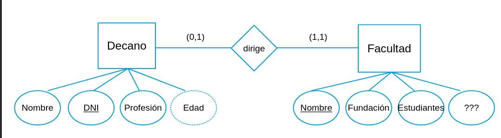
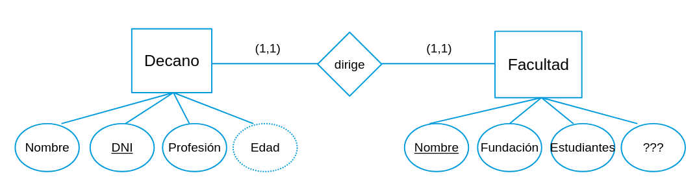
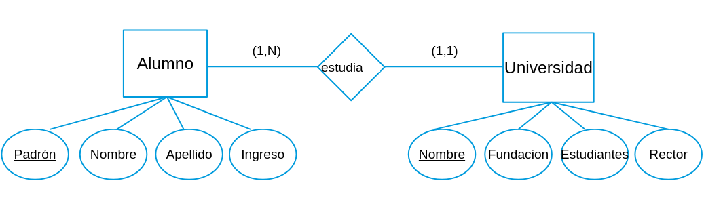
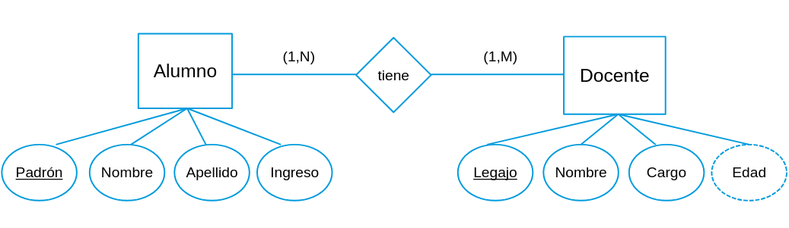

# resumen de parcial

## modelos de bases de datos

ua base de datos es un conjunto de datos interrelacionados, el modelo conceptual describe la semantica de los datos, tiene un conjunto de objetos que son la estructura y propiedades que tienen, conjunto de operaciones, como manipulan los datos y el lenguaje y restricciones

## modelo entidad - relacion

se describe con entidades, atributos y relaciones

### entidad

es un objeto de la vida real que existe por si solo, se nota en singular y representa un elemento en si


#### entidad fuerte

es una entidad que cuya clave candidata o primaria le pertenece a si misma


#### entidad debil

es una entidad cuya clave candidata es una clave foranea, osea no posee una clave en si misma


### Atributo

son los componentes o datos que conforman una entidad, son los datos en si mismo


#### atributos compuestos

son atributos que se componen por otros atributos


#### atributo derivado

es un atributo que deriva de otro


#### atributos multivaluado

es un atributo que almacena varios valores


### dominio de los atributos

es conjunto de valores que puede tomar un atributo, no confundir con tipo de datos, (ejemplo: dni puede ser un int, ahora no puede ser ni 0 ni negativo)

### null

un valor puede ser null o bien porque no aplica o porque el valor es desconocido

## restriccion de unicidad

toda entidad debe tener un atributo clave que la distinga de las demas entidades

## restriccion de unicidad minimal

el conjunto de atributos clave debe ser minimal, ningun subconjunto del mismo debe ser capaz de identificar univocamente a las entidades

### relacion

son las asociaciones entres distintas entidades, se notan con un rombo, estas pueden tener atributos pero no claves

#### binaria

es una relacion de dos entidades


#### ternaria

es una relacion de tres entidades


### restricciones

son las restricciones en una relacion, se dividen en (participacion,cardinalidad) donde participacion es el numero minimo de tuplas que puede tener la relacion y cardinalidad el maximo de tuplas participantes de la relacion, estas se marcan invertidas (en el ejemplo, 1 cliente puede tener una sola condicion fiscal, ahora una condicion fiscal puede no tenerse directamente o tener mas de una) 


### participacion total

todas las entidades deben estar asociadas a la relacion (participacion minima 1)

### participacion parcial

la participacion es opcional (participacion minima 0)

### especializacion

se define un conjunto de subclases para una entidad

### generalizacion

es una abstraccion comun para un conjunto de entidades, en definitiva, se diferencia en que una especializacion se crea primero las entidades y luego las sub entidades, en la generalizacion en cambio se parten de entidades distintas que comparten una serie de atributos


### union

es como la especializacion pero cada sub entidad tiene sus propias claves, la entidad padre viene a agregar atributos comunes a las mismas


### agregacion

se usa para hacer una relacion entre relaciones, como no se puede hacer una relacion con otra relacion, se engloba a una de las relaciones junto con su entidad para tratarlas como una entidad en si misma, se empaqueta una relacion y sus entidades para participar en otra relacion 


## modelo relacional

es un modelo logico que representa los elementos del mundo real como relaciones

### relacion

es un conjunto de tuplas que comparten un esquema de atributos cada uno con su respectivo dominio, estas se representan como tablas, las filas son las tuplas y las columnas los atributos, y se notan R(A1,A2,...,An) donde R es el nombre de la relacion y A son los atributos

no se pueden repetir tuplas en una relacion

### grado

es el numero de atributos que tiene una relacion

### cardinalidad

es el numero de tuplas que tiene una relacion

## claves

son antributos que identifican a una tupla (una entidad/relacion individual) de otras tuplas

### superclave

es el conjunto de todos los atributos que identifican a una tupla de otra

### clave candidata

es el conjunto minimo de claves

### clave primaria

son es una clave arbitraria elegida de entre las claves candidatas, se nota con un subrayado solido

### clave foranea

son las claves que pertenecen a otra entidad, se notan con subrayado (estas no son compatibles en el modelo ER)

## restricciones de integridad

### integridad de entidad

ninguna tupla puede tener un valor nulo en su clave primaria

### integridad referencial

si una tupla tiene una clave foranea, el valor de la misma debe coincidir con el valor de una clave primaria en otra relacion o ser nulo

## mapeo de modelo ER a relacional

### entidades fuertes

se mapea cada entidad fuerte a una relacion, los atributos de la entidad se convierten en atributos de la relacion, la clave primaria de la entidad se convierte en la clave primaria de la relacion

### atributos derivados

no se mapean

### atributos compestos

se mapean sus atributos simples


```
pasa a ser

(primer_nombre, primer_apellido)
```

### atributos multivaluado

se crea una nueva relacion para el atributo multivaluado, la clave primaria de la entidad original se convierte en clave foranea en la nueva relacion, el atributo multivaluado se convierte en un atributo de la nueva relacion, la clave primaria de es el atributo multivaluado.


```pasa a ser

(dni, email) con dni como clave foranea y email como clave primaria
```


### entidades debiles

se crea una relacion para la entidad debil, los atributos de la entidad se convierten en atributos de la relacion, la clave primaria de la entidad fuerte se convierte en clave foranea en la nueva relacion, la clave primaria de la nueva relacion es la combinacion de la clave primaria de la entidad fuerte y la clave parcial de la entidad debil


```pasa a ser

(razonsocial, nro_mesa) con razonsocial como clave foranea y (razonsocial,nro_mesa) como clave primaria
```

### relaciones

estas se mapean dependiendo de su tipo

#### relacion binaria 1:1 parcial

se elige una de las dos entidades participantes y se agrega la clave primaria de la otra entidad como clave foranea en la entidad elegida, si la participacion es total en alguna de las dos entidades, se debe elegir esa entidad para agregar la clave foranea



```pasa a ser

en este  caso la participacion total la tienen facultad, entonces a decano se le agrega la clave primaria de facultad como clave foranea

decano(nombre, dni, profesion, facultad_nombre) con facultad_nombre como clave foranea
```

#### relacion binaria 1:1 total

se crea una nueva relacion, se agregan las claves primarias de ambas entidades como claves foraneas en la nueva relacion, la clave primaria de la nueva relacion es la combinacion de las claves primarias de ambas entidades



```pasa a ser

facultad_decano(facultad_nombre, decano_dni) con ambas como claves foraneas y (facultad_nombre, decano_dni) como clave primaria
```

#### relacion binaria 1:1 1:n

en este caso se agrega la clave primaria de la entidad del lado 1 como clave foranea en la entidad del lado n




```pasa a ser

alumno(padro, nombre, apellido, ingreso, nombre_facultad) con nombre_facultad como clave foranea
```

#### relacion binaria 1:n 1:m

en este caso se crea una nueva relacion, se agregan las claves primarias de ambas entidades como claves foraneas en la nueva relacion, la clave primaria de la nueva relacion es la combinacion de las claves primarias de ambas entidades




```pasa a ser

alumno_docente(alumno_padron, docente_dni) con ambas como claves foraneas y (alumno_padron, docente_dni) como clave primaria
```

