# resumen de parcial

## modelos de bases de datos

ua base de datos es un conjunto de datos interrelacionados, el modelo conceptual describe la semantica de los datos, tiene un conjunto de objetos que son la estructura y propiedades que tienen, conjunto de operaciones, como manipulan los datos y el lenguaje y restricciones

## modelo entidad - relacion

se describe con entidades, atributos y relaciones

### entidad

es un objeto de la vida real que existe por si solo, se nota en singular y representa un elemento en si

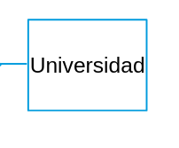

#### entidad fuerte

es una entidad que cuya clave candidata o primaria le pertenece a si misma

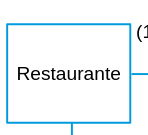

#### entidad debil

es una entidad cuya clave candidata es una clave foranea, osea no posee una clave en si misma

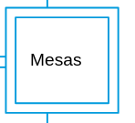

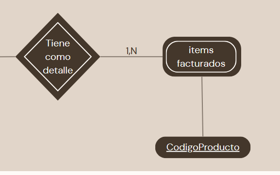

### Atributo

son los componentes o datos que conforman una entidad, son los datos en si mismo

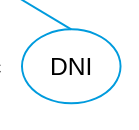

#### atributos compuestos

son atributos que se componen por otros atributos

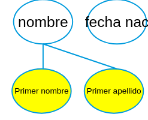

#### atributo derivado

es un atributo que deriva de otro

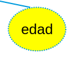

#### atributos multivaluado

es un atributo que almacena varios valores

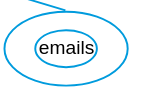

### dominio de los atributos

es conjunto de valores que puede tomar un atributo, no confundir con tipo de datos, (ejemplo: dni puede ser un int, ahora no puede ser ni 0 ni negativo)

### null

un valor puede ser null o bien porque no aplica o porque el valor es desconocido

## restriccion de unicidad

toda entidad debe tener un atributo clave que la distinga de las demas entidades

## restriccion de unicidad minimal

el conjunto de atributos clave debe ser minimal, ningun subconjunto del mismo debe ser capaz de identificar univocamente a las entidades

### relacion

son las asociaciones entres distintas entidades, se notan con un rombo, estas pueden tener atributos pero no claves

#### binaria

es una relacion de dos entidades

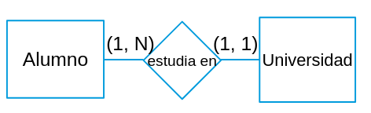

#### ternaria

es una relacion de tres entidades

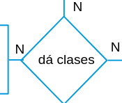

### restricciones

son las restricciones en una relacion, se dividen en (participacion,cardinalidad) donde participacion es el numero minimo de tuplas que puede tener la relacion y cardinalidad el maximo de tuplas participantes de la relacion, estas se marcan invertidas (en el ejemplo, 1 cliente puede tener una sola condicion fiscal, ahora una condicion fiscal puede no tenerse directamente o tener mas de una) 

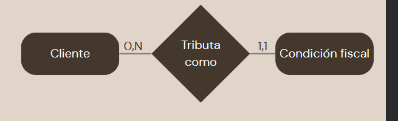

### participacion total

todas las entidades deben estar asociadas a la relacion (participacion minima 1)

### participacion parcial

la participacion es opcional (participacion minima 0)

### especializacion

se define un conjunto de subclases para una entidad

### generalizacion

es una abstraccion comun para un conjunto de entidades, en definitiva, se diferencia en que una especializacion se crea primero las entidades y luego las sub entidades, en la generalizacion en cambio se parten de entidades distintas que comparten una serie de atributos

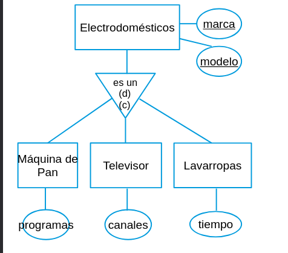

### union

es como la especializacion pero cada sub entidad tiene sus propias claves, la entidad padre viene a agregar atributos comunes a las mismas

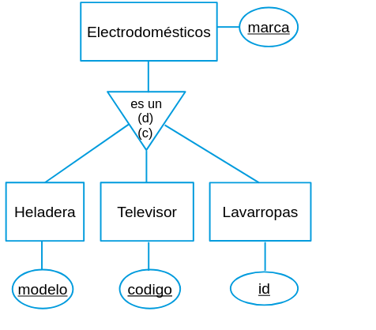

### agregacion

se usa para hacer una relacion entre relaciones, como no se puede hacer una relacion con otra relacion, se engloba a una de las relaciones junto con su entidad para tratarlas como una entidad en si misma, se empaqueta una relacion y sus entidades para participar en otra relacion 

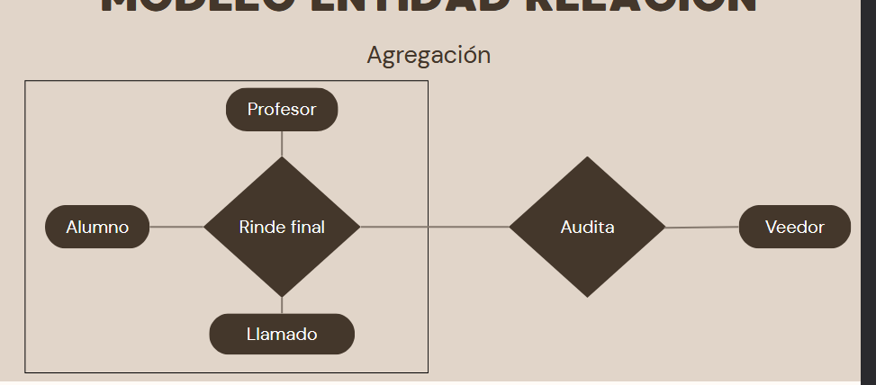

## claves

son antributos que identifican a una tupla (una entidad/relacion individual) de otras tuplas

### superclave

es el conjunto de todos los atributos que identifican a una tupla de otra

### clave candidata

es el conjunto minimo de claves

### clave primaria

son es una clave arbitraria elegida de entre las claves candidatas, se nota con un subrayado solido

### clave foranea

son las claves que pertenecen a otra entidad, se notan con subrayado (estas no son compatibles en el modelo ER)

