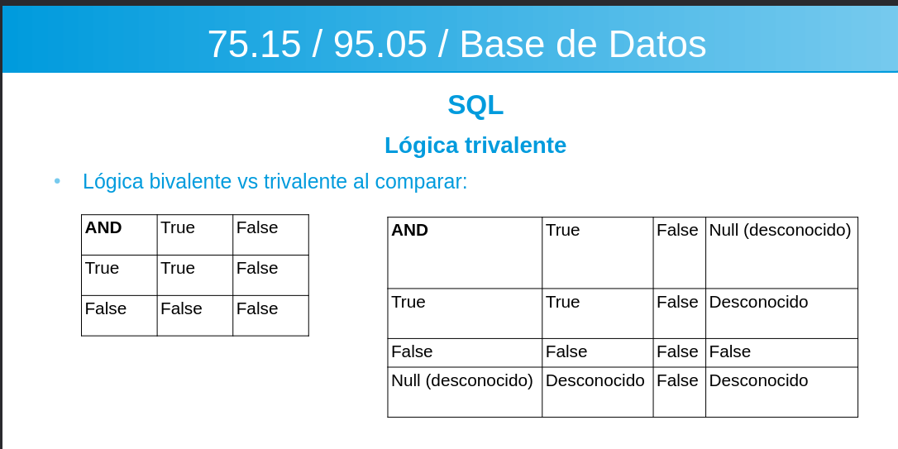
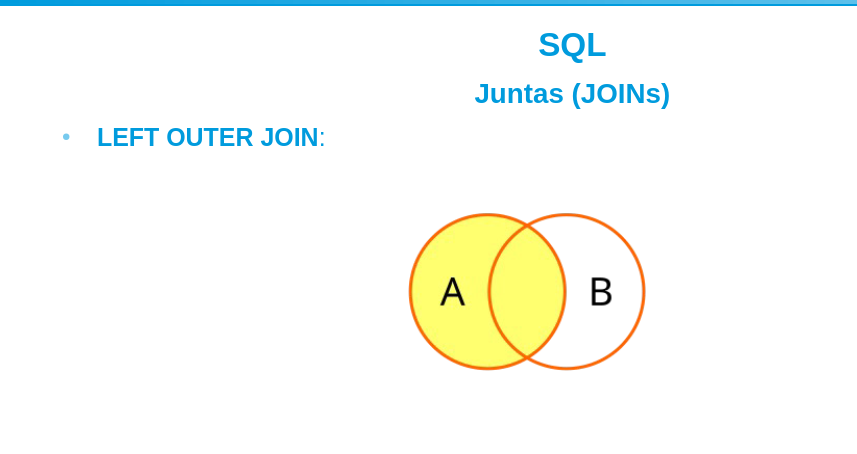
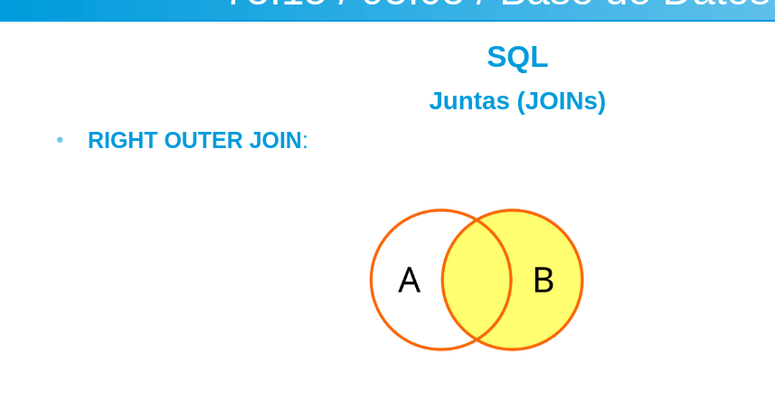
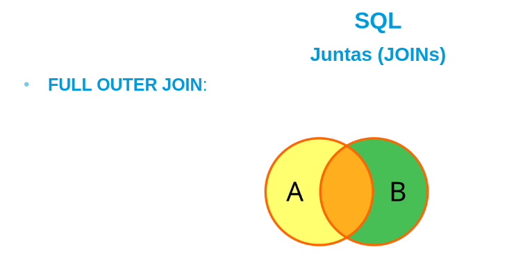
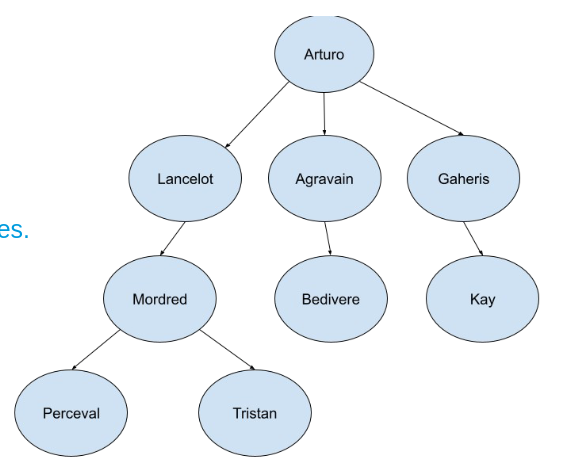

# sql lenguaje

postgress sql

es un lenguaje practico, Structured Query Language, query es consulta, originalmente se llamaba sequel (Structured English Query Language ), lo desarrollo IBM y entre ANSI e ISO hicieron estandares de SQL para tener convenciones, es un lenguaje del tipo Data Definition Language(ddl), y tambien Data Manipulation Lenguage(DML)

## pasar de relacion a SQL

esquema relacion es una tabla, en sql si se permite duplicar filas a menos que se indique lo contrario

una tupla pasa a ser un fila y un atributo una columna

un esquema de bases de datos agrupa tablas, vistas, etc.


con CREATE  creamos un esquema de bases de datos

```SQL
CREATE SCHEMA aplicacion_futbol AUTHORIZATION 'juan'

``` 
## catalogo

es un conjunto de esquemas de bases de datos que tenemos en el motor de bases de datos de la maquina

## crear tablas

```SQL
CREATE TABLE aplicacion_futbol.equipos(nombre VARCHAR(32), funcacion int, PRIMARY KEY (nombre))

o bien

CREATE TABLE equipos(nombre VARCHAR(32), funcacion int, PRIMARY KEY (nombre)) esto si ya seleccionamos la base de datos


```


las tablas se guardan en un archivo, es un lenguaje estructurado SQL, esto dado a que los atributos son de tipado solido y las estructuras siempre respetan el contrato


```SQL

CREATE TABLE partidos(equipo1 VARCHAR(32),
                      equipo2 VARCHAR(32)
                      fecha DATE
                      goles_equipo1 int,
                      goles_equipo2 int,
                      FOREING KEY (equipo1) REFERENCES equipos(nombre)
                      FOREING KEY (equipo2) REFERENCES equipos(nombre))
```

## tipos de datos

### numericos

- enteros: INTEGER, INT, SMALLINT
- reales: FLOAT, REAL, DOUBLE PRECISION
- formateados: DECIMAL(i,j), DECI(i,j), NUMERIC(i,j)}

### cadenas de caracteres

- cantidad fija: CHAR(n), CHARACTER(n)
- cantidad variable: VARCHAR(n), CHAR VARYNG(n), n es el maximo
- character large object: (CLOB): CLOB(20) -> 20 MEGABYTES DE TEXTO, este se mide en peso para texto muy largos

### cadenas de bits

fija BIT(n)

valiable BIT VARYING(n)

Binary Large Objetc: (BLOB): BLOB(30M) son 30 megabits


### boleano

true false nule

### tiempo

DATE: yyyy-mm-dd
TIME: HH-MM-SS GMT opcional
timestamp fecha hora y GMT opcional
interval: YEAR/MONTH, DAY/TIME

## crear dominios

```SQL

CREATE DOMAIN tipo_nombre_equipo AS VARCHAR(32)
```

permite que se puedan cambiar facilmente los tipos de dominio de varios atributos

## restricciones

- de dominio: se cumplen al crear tablas y definir dominios
- de unicidad: se cumplen al definir las claves primarias
- de integridad: 
-- de entidad: la clave primaria no toma valor null
-- de integridad referencial: al elegir las claves foraneas

## restringir dominio


check: verifica una condicion contra una constantes

```SQL
CREATE TABLE equipos(nombre VARCHAR(32),
                     division VARCHAR(32),
                     estadio VARCHAR(32),
                     fundacion int NOT NULL CHECK (fundacion > 1800 AND  fundacion < 2025))

```

DOMAIN: crea un dominio con las restricciones que querramos

```SQL
CREATE DOMAIN tipo_fundacion_equipo AS int CHECK((fundacion > 1800 AND  fundacion < 2025))

CREATE TABLE equipos(nombre VARCHAR(32),
                     division VARCHAR(32),
                     estadio VARCHAR(32),
                     fundacion NOT NULL tipo_fundacion_equipo,
                     PRIMARY KEY (nombre) )

```

DEFAULT: te marca un valor por defecto


```SQL

CREATE TABLE equipos(nombre VARCHAR(32),
                     division VARCHAR(32),
                     estadio VARCHAR(32),
                     fundacion int DEFAULT 2000,
                     PRIMARY KEY (nombre) )

```

UNIQUE: ese atributo no se puede repetir en la tabla, util para determinar claves candidata

```SQL

CREATE TABLE equipos(nombre VARCHAR(32),
                     division VARCHAR(32),
                     estadio VARCHAR(32) UNIQUE,
                     fundacion int DEFAULT 2000,
                     PRIMARY KEY (nombre),
                     UNIQUE(estadio))

CREATE TABLE equipos(nombre VARCHAR(32),
                     division VARCHAR(32),
                     estadio VARCHAR(32) UNIQUE,
                     fundacion int DEFAULT 2000,
                    
                     UNIQUE(estadio, fundacion))

```

- las FOREING KEY  nos sirve para la integridad referencial, por lo general los motores rechazan cualquier violacion de integridad,  por defecto lanza error pero hay 3 estrategias para subsanar un borrado

- set null
- cascada
- set default

```SQL
CREATE TABLE jugadores(dni int,
                       nombre VARCHAR(32),
                       apellido VARCHAR(32), 
                       equipo VARCHAR(32),
                       PRIMARY KEY(dni)
                       CONSTRAINT equipo_fk FOREIGN KEY (equipo) REFERENCES equipos(nombre) ON DELETE CASCADE)
    

```


## consultas basicas

- SELECT lista de atributos (proyeccion)
 FROM lista de tablas
 WHERE condicion (puede ser una condicion de seleccion o de junta)

```SQL
SELECT *
FROM equipos
WHERE fundacion > 1980;


SELECT jugadores.*, equipos.nombre, equipos.division
FROM  jugadores.equipos
WHERE jugadores.equipos = equipos.nombre
AND fundacion > 1980;

SELECT k.*, e.nombres AS  bombre_equipo.e.division
FROM jugadores AS j, equipos AS e
WHERE j.equipo = e.nombre
AND fundacion > 1980;

```
DISTINCT: busca los distintos
en SQL no se eliminan filas duplicadas de una consulta salvo que se pida lo contrario

```SQL
SELECT DISTINCT nombre
FROM jugadores
WHERE equipos = "san martin"

```

por omision se realiza un SELECT ALL

con % se busca patrone que cumplan con el %cosa%

LIKE: te matchea carateres
&LIKE: te matchea carateres sin contar las mayusculas

```SQL
SELECT *
FROM jugadores
WHERE equipos LIKE %Martin%;

SELECT *
FROM jugadores
WHERE apellido LIKE %_ _ _ _ _ _ ez%; -> con los guiones bajos SQL juega al ahorcado

```

operadores aritmeticos: +,-,*, /

```SQL
SELECT nombre, apellido, sueldo * 1.1 FROM jugadores;
```

ORDER BY: te define como ordenar
DESC: descendente

```SQL

SELECT nombre.apellido
FROM jugadores
WHERE equipo = 'San Martin',
ORDER BY apellido DESC 

```

UNION(elimina duplicados por omisión) permite unir con la misma restriccion que el relacional (ojo, no se fija si tiene sentido la union), mientras sean del mismo tipo se puede unir, la compatibilidad de los dominos depende de nosotros


```SQL

SELECT nombre, apellido
FROM jugadores
WHERE equipo = “San Martín”

UNION

SELECT nombre, apellido
FROM jugadores
WHERE equipo = “Belgrano”;


```

UNION ALL: permite duplicados

```SQL

SELECT nombre, apellido
FROM jugadores
WHERE equipo = “San Martín”

UNION ALL

SELECT nombre, apellido
FROM jugadores
WHERE equipo = “Belgrano”;


```

EXCEPT(diferencia de conjuntos)(elimina duplicados)

```SQL

SELECT nombre, apellido
FROM jugadores
WHERE equipo = “San Martín”

EXCEPT

SELECT nombre, apellido
FROM jugadores
WHERE equipo = “Belgrano”;


```

EXCEPT ALL(diferencia de conjuntos)(no elimina duplicados)

```SQL

SELECT nombre, apellido
FROM jugadores
WHERE equipo = “San Martín”

EXCEPT ALL

SELECT nombre, apellido
FROM jugadores
WHERE equipo = “Belgrano”;


```

INTERSECT(elimina duplicados)(intersecta)

```SQL

SELECT nombre, apellido
FROM jugadores
WHERE equipo = “San Martín”

INTERSECT

SELECT nombre, apellido
FROM jugadores
WHERE equipo = “Belgrano”;


```


INTERSECT ALL(no elimina duplicados)(intersecta)

```SQL

SELECT nombre, apellido
FROM jugadores
WHERE equipo = “San Martín”

INTERSECT ALL

SELECT nombre, apellido
FROM jugadores
WHERE equipo = “Belgrano”;


```

## insersion

```SQL
INSERT INTO jugadores(nombre, apellido, equipo) VALUES("juan", "gomez", "estudiantes de catamarca");


INSERT INTO jugadores(nombre, apellido) VALUES("juan","gomez") aca equipo seria NULL

INSERT INTO jugadores_de_primera(nombre, apellido, equipo) 

SELECT j.nombre, j.apellido, j.equipo
FROM jugadores e, equipos e
WHERE j.equipo = e.nombre
AND e.division = 'primera';


```

## borrado

eliminamos tuplas con una condicion

```SQL
DELETE 
FROM jugadores 
WHERE equipo = 'San Martin';

tambien podemos elminar sin condiciones pero borramos toda las tuplas

DELETE FROM jugadores;

```
**pro tip: antes de cualquier delete cambia delete por select asi vez exactamente lo que vas a borrar**


## actualizar

actualizamos tuplas segun condicion

```SQL

UPDATE jugadores

SET equipos = 'San Martin de santiago del estero'

WHERE equipo = 'San Martin';


```

## logica trivalente

existen 3 motivos para usar un null

- valor desconocido
- valor no disponible
- valor no aplicable

afeca por ejemplo en los joins ya que la condicion de junta puede no cumplirse




tambien se puede pedir especialmente las que tengan null

```sql
SELECT *
FROM profesores
WHERE legajo IS NULL

```

## consultas anidadas

- podemos utlizar las clausulas ANY(equivalente a SOME) y all
- es conveniente utilizar alias para las tablas que compartan mismo nombre de atributos

ejemplo

```sql
SELECT * FROM profesores
WHERE sueldo >= ALL(SELECT sueldo FROM profesores);

```

## consultas anidadas correlacionadas

consultas que poseen una referencia entra la culta interna y externa

ejemplo:

```sql
SELECT a.nombre, a.apellido
FROM alumno AS a
WHERE a.padron IN(SELECT na.padron
                  FROM notas_alumnos AS na
                  WHERE a.padron = na.padron
                  AND na.materia = 'base de datos'
                  AND na.nota_final >= 7)
```

## exist

- compara si existe al menos una tupla dentro de la tabla que cumpla la condicion

```SQL
SELECT a.nombre, a.apellido
FROM alumnos AS a
WHERE EXISTS (SELECT *
              FROM notas_alumnos AS na
              WHERE a.padron = na.padron
              AND na.materia = ‘Base de Datos’
              AND na.nota_final >= 7);

```

## unique(no siempre esta implementado en algunos SGBD)

indica si una consulta tiene tuplas duplicadas

```sql
SELECT a.nombre, a.apellido
FROM alumnos AS a
WHERE EXISTS (SELECT *
              FROM notas_alumnos AS na
              WHERE a.padron = na.padron
              AND na.materia = ‘Base de Datos’
              AND na.nota_final >= 7);


```


## joins

- permite separar las condiciones de seleccion de las condiciones de junta haciendo mas clara la semantica

ejemplo: buscamos docentes que dicten materias a partir del año 2002

```SQL
SELECT d.nombre, d.apellido, d.legajo, m.codigo
FROM docentes AS d
JOIN materias AS m
ON d.legajo = m.docente
WHERE m.inicio > 2002; -- año inicio de la materia.
-- los comentarios son con --
```

### outer joins

- LEFT OUTER JOIN
- RIGHT OUTER JOIN
- FULL OUTER JOIN

la palabra OUTER es opcional

de esos 3 se puede hacer un natural join siempre que los atributos coincidan en nombre en las tablas a joinear




```sql
SELECT d.nombre, d.apellido, d.legajo, m.codigo
FROM docentes d
LEFT OUTER JOIN materias m
ON d.legajo = m.docente
WHERE m.inicio > 2002; -- año inicio de la materia.

```


```sql
SELECT d.nombre, d.apellido, d.legajo, m.codigo
FROM docentes d
RIGHT OUTER JOIN materias m
ON d.legajo = m.docente
WHERE m.inicio > 2002; -- año inicio de la materia.

```

## full outer join



```SQL

SELECT d.nombre, d.apellido, d.legajo, m.codigo
FROM docentes d
FULL OUTER JOIN materias m
ON d.legajo = m.docente
WHERE m.inicio > 2002; -- año inicio de la materia.

```


## agregaciones

### count

devuelve la cantidad de tuplas o valores de consulta

```sql
SELECT COUNT(*)
FROM alumnos; -- cuenta todos los alumnos

SELECT COUNT(padron)
FROM alumnos; -- cuenta los padrones si hay nulo no lo cuenta 

```

### SUM, MAX, MIN, AVG

suma todo, busca maximo, minimo y promedio

```sql

SELECT SUM(sueldo), MAX(sueldo), MIN(sueldo) AVG(sueldo)
FROM docentes;

```
### some/any

se aplica a una lista de valores booleanos, devuelve true si al menos un elemento es true


### all

devuelve true si toda la lista es true 

```sql 
SELECT *
FROM alumnos
WHERE promedio >= ALL (SELECT promedio FROM alumnos);

```

## GROUP BY y HAVING

group by sirve para agrupar tuplas, (no sirve para ordenar) , having filtra los agrupamientos, los atributos agrupados deben ser proyectados

```sql
SELECT cargo, AVG(sueldo)
FROM docentes
GROUP BY cargo;

SELECT cargo, COUNT(*)
FROM docentes
GROUP BY cargo;

SELECT cargo, COUNT(*)
FROM docentes
GROUP BY cargo
HAVING cargo <> “Ayudante 1” AND cargo <> “Ayudante 2”;

SELECT cargo, COUNT(*)
FROM docentes
GROUP BY cargo
HAVING cargo <> “Ayudante 1” AND cargo <> “Ayudante 2”;
```

## WITH

crea una tabla temporal cion nuna condicion especifica para poder hacer mas divididas las consultas

```sql
WITH docentes_no_ayudantes (cargo)
(SELECT cargo
FROM docentes
WHERE cargo <> “Ayudante 1” AND cargo <> “Ayudante 2”
)
SELECT cargo, count(*) FROM docentes_no_ayudantes GROUP BY cargo

```


## recursive with

permite realizar consultas recursivas



```sql
WITH RECURSIVE feudo AS (
SELECT vasallo_de v FROM vasallos WHERE nombre = 'Tristan'
UNION
SELECT vasallo_de FROM feudo, vasallos WHERE feudo.v = vasallos.nombre
)
SELECT * FROM feudo;

```

## CASE

permite mostrar valores en base a condiciones, se puede usar en consultas, actualizaciones o insersiones

```SQL
WITH RECURSIVE feudo AS (
SELECT vasallo_de v FROM vasallos WHERE nombre = 'Tristan'
UNION
SELECT vasallo_de FROM feudo, vasallos WHERE feudo.v = vasallos.nombre
)
SELECT * FROM feudo;

```

## ASSERTIONS

son restricciones como loscheks y es mejor usar los checks, sirven para deshabilitar, modificar o eliminar restricciones

```sql
SELECT nombre, apellido,
CASE WHEN cargo = ‘Profesor’ THEN ‘Profesor adjunto’
WHEN cargo = ‘JTP’ THEN ‘Jefe de Trabajos Prácticos’
WHEN cargo = ‘Ayudante 1’ THEN ‘Ayudante de Primera’
WHEN cargo = ‘Ayudante 2’ THEN ‘Ayudante de Segunda’
END
FROM docentes;
```


## triggers

permite desatar un evento segun una condicion, tiene un evento, una condicion y una accion, condicion es opcional

```sql
CREATE ASSERTION sueldo_docente
CHECK ( NOT EXISTS (SELECT *
FROM docentes d
WHERE d.sueldo < 60000) 
```

## vistas 

es una tabla que deriva de otra tabla, permite dar autorizaciones segun cuanto acceso a datos se quiera brindar


```sql
CREATE VIEW alumnos_y_docentes(nombre, apellido, padron_o_legajo) AS
SELECT a.nombre, a.apellido, a.padron FROM alumnos a UNION
SELECT d.nombre, d.apellido, d.legajo FROM docentes d;
```
 drop_view borra


## cambios de esquema

- drop schema(borra la bd, usar con cariño)
- drop table(borra tabla)
- drop table tabla cascade(borra tablas asociadas)
- alter table tabla add column columna(agraga una columna a una table)
- alter table tabla drop column columna(borra una columna a una table)
- alter table tabla alter column columna tipo_dato(cambia el tipo de una columna)

## funciones de sql 

- SUBSTRING corta una cadena ejemplo: SELECT SUBSTRING(apellido, 1, 8)

- UPPER pone la cadena en mayusculas

- char_lenght(va en minusculas) indica cuantos caracteres tiene una cadena

- EXTRAC: permite extraer una fecha o time stamp el año, hora , etc

- COALESCE: muestra el primer valor que sea distinto a null

- CAST: permite convertir valores
